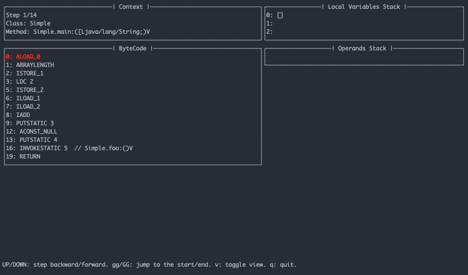
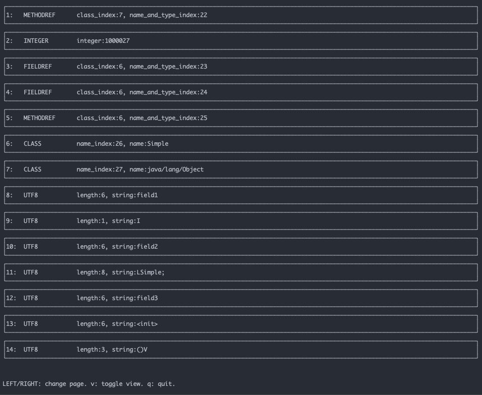

# JVM state visualizer
Simple extension of `python-jvm-interpreter` that allows to single step through (forward and backward) a Java function and inspect the JVM state (local variable stack and operand stack).

Usage:

`./run.py </path/to/.java file> <class> <method> [<python repr(arguments)>]`

Examples from the Runtime Systems (CS263) class:

`./run.py examples/example1.java Simple main '[]'`

`./run.py examples/example2.java Hello main '[]'`

`./run.py examples/example3.java test main '[]'`

`./run.py examples/handout.java Simple main '[]'`

More examples: (see the `examples/more` folder)

`./run.py examples/more/Array.java ArrayTest sum '[1, 2, 3, 4]'`

# Execution View

# Constant Pool View

# JVM implementation in Python
_python-jvm-interpreter_ is an implementation of the Java Virtual Machine in
Python. It works by parsing and interpreting the Java Class files.

## Dependencies
In order to compile Java code to Java Bytecode, you will need to have
`javac`. If you just want to run bytecode that is already compiled, all you need
is a Python interpreter and the required packages in `requirements.txt`.

## Running the tests
The project comes with a number of unit tests. If you run the shell script
`test.sh`, it will compile the Java files in the example directory and run the
unit tests. You will be able to see how many test passed and how many failed.

Even if you haven't touched anything critical, it is always a good idea to run
the unit tests after each change. This will make sure that nothing breaks, and
if it does you will immediately know why it broke.

As more functionality is implemented, the amount of test cases should be
increased in order to make it easier to check if anything is broken.
